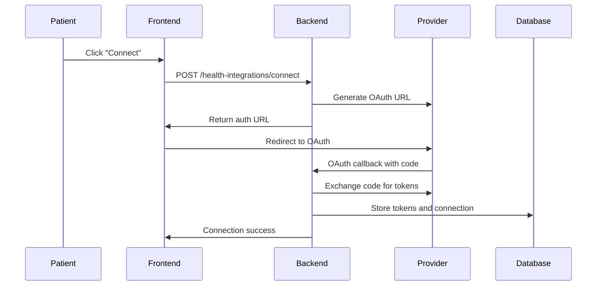
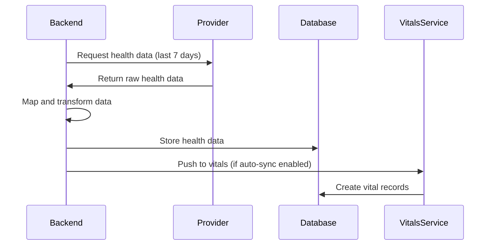

# Health Data Integrations Setup Guide

This guide explains how to set up and configure health data integrations with Apple HealthKit, Samsung Health, and Google Fit for the Rapid Capsule platform.

## Overview

The health integrations system allows patients to:
- Connect their health apps (Apple Health, Samsung Health, Google Fit)
- Automatically sync vital signs and health metrics
- Push health data into the Rapid Capsule vitals system
- Track health trends over time
- Share comprehensive health data with specialists

## Architecture

### Backend Components
- **Health Integrations Module** (`/modules/health-integrations/`)
- **Health Integration Schema** - Stores connection details and tokens
- **Health Data Schema** - Stores synchronized health metrics
- **Integration Service** - Handles OAuth flows and data synchronization
- **Data Mapping** - Converts platform-specific data to unified format

### Frontend Components
- **Integration Settings** (`/App-settings/Integrations/`)
- **Health Service** - API calls to backend
- **Real-time Status** - Connection status and sync indicators

## Setup Instructions

### 1. Google Fit Integration

#### Google Cloud Console Setup
1. Go to [Google Cloud Console](https://console.cloud.google.com/)
2. Create a new project or select existing project
3. Enable the **Google Fitness API**
4. Create OAuth 2.0 credentials:
   - Application type: Web application
   - Authorized redirect URIs: `https://rapidcapsule.com/app/patient/app-settings`
5. Note down Client ID and Client Secret

#### Required Scopes
```
https://www.googleapis.com/auth/fitness.activity.read
https://www.googleapis.com/auth/fitness.activity.write
https://www.googleapis.com/auth/fitness.blood_glucose.read
https://www.googleapis.com/auth/fitness.blood_glucose.write
https://www.googleapis.com/auth/fitness.blood_pressure.read
https://www.googleapis.com/auth/fitness.blood_pressure.write
https://www.googleapis.com/auth/fitness.body.read
https://www.googleapis.com/auth/fitness.body.write
https://www.googleapis.com/auth/fitness.body_temperature.read
https://www.googleapis.com/auth/fitness.body_temperature.write
https://www.googleapis.com/auth/fitness.heart_rate.read
https://www.googleapis.com/auth/fitness.heart_rate.write
https://www.googleapis.com/auth/fitness.sleep.read
https://www.googleapis.com/auth/fitness.sleep.write
```

#### Environment Configuration
Update `ecosystem.config.js`:
```javascript
// Backend
GOOGLE_FIT_CLIENT_ID: "your_google_fit_client_id",
GOOGLE_FIT_CLIENT_SECRET: "your_google_fit_client_secret",
GOOGLE_FIT_REDIRECT_URI: "https://rapidcapsule.com/app/patient/app-settings?provider=google_fit",

// Frontend
VUE_APP_GOOGLE_FIT_CLIENT_ID: "your_google_fit_client_id",
```

### 2. Samsung Health Integration

#### Samsung Developers Setup
1. Go to [Samsung Developers](https://developer.samsung.com/)
2. Create Samsung Health app:
   - Register your app
   - Enable Samsung Health permissions
   - Configure OAuth redirect URI: `https://rapidcapsule.com/app/patient/app-settings`
3. Note down App ID and App Secret

#### Required Permissions
- Read/Write access to:
  - Heart Rate
  - Steps
  - Sleep
  - Weight
  - Blood Pressure
  - Blood Glucose
  - Exercise/Activities

#### Environment Configuration
Update `ecosystem.config.js`:
```javascript
// Backend
SAMSUNG_HEALTH_CLIENT_ID: "your_samsung_health_client_id",
SAMSUNG_HEALTH_CLIENT_SECRET: "your_samsung_health_client_secret",
SAMSUNG_HEALTH_REDIRECT_URI: "https://rapidcapsule.com/app/patient/app-settings?provider=samsung_health",

// Frontend
VUE_APP_SAMSUNG_HEALTH_CLIENT_ID: "your_samsung_health_client_id",
```

### 3. Apple HealthKit Integration

**Note:** Apple HealthKit requires a native mobile application. Web-based access is not supported.

#### iOS App Requirements
1. **Xcode Project Setup**
   - Add HealthKit capability
   - Configure Info.plist with health data usage descriptions

2. **Required Frameworks**
   ```swift
   import HealthKit
   ```

3. **Health Data Types**
   ```swift
   let healthDataTypes: Set<HKObjectType> = [
       HKQuantityType.quantityType(forIdentifier: .heartRate)!,
       HKQuantityType.quantityType(forIdentifier: .stepCount)!,
       HKQuantityType.quantityType(forIdentifier: .bloodPressureSystolic)!,
       HKQuantityType.quantityType(forIdentifier: .bloodGlucose)!,
       HKQuantityType.quantityType(forIdentifier: .bodyMass)!,
       HKCategoryType.categoryType(forIdentifier: .sleepAnalysis)!
   ]
   ```

#### Environment Configuration
Update `ecosystem.config.js`:
```javascript
// Backend & Frontend
APPLE_HEALTH_APP_ID: "com.rapidcapsules.health",
```

## API Endpoints

### Health Integrations API

#### Get User Integrations
```http
GET /api/health-integrations
Authorization: Bearer <jwt_token>
```

#### Connect Integration
```http
POST /api/health-integrations/connect
Content-Type: application/json
Authorization: Bearer <jwt_token>

{
  "provider": "google_fit|samsung_health|apple_health",
  "dataTypes": ["heart_rate", "steps", "calories", "sleep"],
  "autoSync": true,
  "syncDirection": "bidirectional",
  "metadata": {
    "syncFrequency": "daily"
  }
}
```

#### Sync Health Data
```http
POST /api/health-integrations/sync/{provider}
Content-Type: application/json
Authorization: Bearer <jwt_token>

{
  "dataTypes": ["heart_rate", "steps"],
  "startDate": "2024-01-01T00:00:00Z",
  "endDate": "2024-01-07T23:59:59Z"
}
```

#### Get Health Data
```http
GET /api/health-integrations/data?provider=google_fit&dataType=heart_rate
Authorization: Bearer <jwt_token>
```

#### Disconnect Integration
```http
DELETE /api/health-integrations/{provider}
Authorization: Bearer <jwt_token>
```

## Data Flow

### 1. Connection Flow


### 2. Data Sync Flow


## Data Mapping

### Supported Health Data Types
```javascript
const HEALTH_DATA_TYPES = {
  HEART_RATE: 'heart_rate',
  BLOOD_PRESSURE: 'blood_pressure',
  BLOOD_GLUCOSE: 'blood_glucose',
  BODY_TEMPERATURE: 'body_temperature',
  OXYGEN_SATURATION: 'oxygen_saturation',
  WEIGHT: 'weight',
  HEIGHT: 'height',
  BMI: 'bmi',
  STEPS: 'steps',
  CALORIES_BURNED: 'calories_burned',
  DISTANCE: 'distance',
  SLEEP: 'sleep',
  ACTIVITY: 'activity',
};
```

### Platform-Specific Mapping

#### Google Fit → Rapid Capsule
```javascript
{
  'com.google.heart_rate.bpm': 'heart_rate',
  'com.google.blood_pressure': 'blood_pressure',
  'com.google.step_count.delta': 'steps',
  'com.google.calories.expended': 'calories_burned',
  'com.google.weight': 'weight',
  'com.google.sleep.segment': 'sleep'
}
```

#### Samsung Health → Rapid Capsule
```javascript
{
  'heart_rate': 'heart_rate',
  'blood_pressure': 'blood_pressure',
  'step_count': 'steps',
  'calories': 'calories_burned',
  'weight': 'weight',
  'sleep': 'sleep'
}
```

#### Apple HealthKit → Rapid Capsule
```javascript
{
  'HKQuantityTypeIdentifierHeartRate': 'heart_rate',
  'HKQuantityTypeIdentifierBloodPressureSystolic': 'blood_pressure',
  'HKQuantityTypeIdentifierStepCount': 'steps',
  'HKQuantityTypeIdentifierActiveEnergyBurned': 'calories_burned',
  'HKQuantityTypeIdentifierBodyMass': 'weight',
  'HKCategoryTypeIdentifierSleepAnalysis': 'sleep'
}
```

## User Experience

### Integration Status Indicators
- ✅ **Connected** - Integration active and syncing
- ⏳ **Pending** - OAuth flow in progress
- ❌ **Disconnected** - No integration configured
- ⚠️ **Error** - Connection or sync issues

### Sync Settings
- **Auto-sync**: Automatically sync new data
- **Sync Frequency**: Hourly, Daily, Weekly, Manual
- **Data Types**: Select which metrics to sync
- **Sync Direction**: Pull only, Push only, or Bidirectional

### Data Preview
- Recent synchronized health data
- Quick push to vitals functionality
- Link to full vitals dashboard

## Security & Privacy

### Data Protection
- OAuth 2.0 authentication with provider APIs
- Encrypted token storage in database
- User consent for each data type
- Right to disconnect and delete data

### Compliance
- HIPAA compliance for health data handling
- GDPR compliance for EU users
- Platform-specific privacy requirements

## Testing

### Manual Testing Steps
1. **Connection Test**
   - Navigate to App Settings → Integrations
   - Click "Connect" for each provider
   - Complete OAuth flow
   - Verify connection status

2. **Sync Test**
   - Trigger manual sync
   - Verify data appears in health data preview
   - Check data accuracy and completeness

3. **Vitals Integration Test**
   - Push health data to vitals
   - Navigate to Health Monitor → Vitals
   - Verify data appears in vitals dashboard

### Automated Testing
```bash
# Backend tests
cd RC-Backend
npm test -- --grep="health-integrations"

# Frontend tests
cd RC
npm run test:unit -- --match="*HealthIntegrations*"
```

## Deployment

### Backend Deployment
```bash
cd RC-Backend
npm run build
pm2 restart RC-Backend
```

### Frontend Deployment
```bash
cd RC
npm run build
pm2 restart RC-Frontend
```

### Database Migration
```javascript
// Health integrations collections will be created automatically
// No manual migration required
```

## Troubleshooting

### Common Issues

#### 1. OAuth Callback Failures
- **Cause**: Incorrect redirect URI configuration
- **Solution**: Verify redirect URIs in provider developer consoles

#### 2. Token Refresh Failures
- **Cause**: Expired refresh tokens
- **Solution**: Re-authenticate users with failed tokens

#### 3. Data Sync Delays
- **Cause**: Provider API rate limits
- **Solution**: Implement exponential backoff and retry logic

#### 4. Missing Health Data
- **Cause**: Insufficient permissions or empty data sets
- **Solution**: Check provider app permissions and data availability

### Error Codes
- `INTEGRATION_NOT_FOUND`: Integration doesn't exist
- `OAUTH_FAILED`: OAuth authentication failed
- `SYNC_ERROR`: Data synchronization failed
- `PERMISSION_DENIED`: Insufficient permissions
- `RATE_LIMIT_EXCEEDED`: API rate limit hit

## Monitoring

### Health Metrics to Monitor
- Integration connection success rates
- Data sync success rates
- API response times
- Error frequencies by provider
- User engagement with health features

### Logs to Monitor
- OAuth callback successes/failures
- Data sync operations
- API rate limit warnings
- Data mapping errors

## Future Enhancements

### Planned Features
- **Fitbit Integration** - Additional wearable device support
- **Garmin Integration** - Professional athlete market
- **Real-time Streaming** - Live health data updates
- **AI Health Insights** - Machine learning on health trends
- **Health Scoring** - Comprehensive health assessment
- **Provider Webhooks** - Real-time data push from providers

### Technical Improvements
- **Background Sync Service** - Scheduled data synchronization
- **Conflict Resolution** - Handle duplicate or conflicting data
- **Data Validation** - Enhanced data quality checks
- **Performance Optimization** - Faster sync operations
- **Offline Support** - Cache and sync when connectivity restored

---

## Support

For technical support or questions about health integrations:
- **Developer Documentation**: This guide
- **API Documentation**: OpenAPI spec at `/api/docs`
- **Issues**: Report in project issue tracker
- **Contact**: development team

Last Updated: August 22, 2025
Version: 1.0.0