# Rapid Capsule - Visual Architecture Diagrams

> Mermaid-based visual diagrams for system architecture documentation
> Optimized for GitHub rendering, presentations, and Global Talent Visa evidence

---

## Table of Contents

1. [System Overview](#1-system-overview)
2. [High-Level Architecture](#2-high-level-architecture)
3. [Service Communication](#3-service-communication)
4. [Authentication Flow](#4-authentication-flow)
5. [AI Health Checkup Flow](#5-ai-health-checkup-flow)
6. [Advanced Health Score System](#6-advanced-health-score-system)
7. [Prescription System Flow](#7-prescription-system-flow)
8. [WhatsApp Pharmacy Integration](#8-whatsapp-pharmacy-integration)
9. [Payment Processing Flow](#9-payment-processing-flow)
10. [Appointment Booking Flow](#10-appointment-booking-flow)
11. [Database Entity Relationships](#11-database-entity-relationships)
12. [Security Architecture](#12-security-architecture)
13. [Deployment Architecture](#13-deployment-architecture)
14. [Technology Stack](#14-technology-stack)

---

## 1. System Overview

```mermaid
graph TB
    subgraph Users["👥 Users"]
        P[("🏥 Patients")]
        S[("👨‍⚕️ Specialists")]
        L[("🚑 Lifeguards")]
        A[("👔 Administrators")]
    end

    subgraph Frontend["🖥️ Frontend Layer"]
        PF["Patient App<br/>Vue.js 3 SPA<br/>Port 3000"]
        AF["Admin Portal<br/>Vue.js 3 + Vuetify 3<br/>Port 8080"]
    end

    subgraph Gateway["🔀 API Gateway"]
        NG["NGINX<br/>SSL Termination<br/>Load Balancing"]
    end

    subgraph Backend["⚙️ Backend Services"]
        PB["Patient Backend<br/>NestJS<br/>Port 5020"]
        AB["Admin Backend<br/>NestJS<br/>Port 5021"]
        WS["WebSocket Server<br/>Socket.io"]
    end

    subgraph Data["💾 Data Layer"]
        DB[("MongoDB<br/>Shared Database")]
        S3[("AWS S3<br/>File Storage")]
    end

    subgraph External["🌐 External Services"]
        INF["Infermedica AI<br/>Diagnosis Engine"]
        CL["Claude AI<br/>Health Summaries"]
        ZM["Zoom API<br/>Video Calls"]
        PS["Paystack<br/>Payments"]
        TW["Twilio/Gupshup<br/>WhatsApp & SMS"]
        TX["AWS Textract<br/>OCR"]
    end

    P --> PF
    S --> PF
    L --> PF
    A --> AF

    PF --> NG
    AF --> NG

    NG --> PB
    NG --> AB

    PB <--> WS
    AB <--> WS

    PB --> DB
    AB --> DB
    PB --> S3

    PB --> INF
    PB --> CL
    PB --> ZM
    PB --> PS
    PB --> TW
    PB --> TX

    AB --> CL

    style P fill:#e1f5fe
    style S fill:#e8f5e9
    style L fill:#fff3e0
    style A fill:#fce4ec
    style PF fill:#bbdefb
    style AF fill:#f8bbd9
    style PB fill:#c8e6c9
    style AB fill:#ffccbc
    style DB fill:#fff9c4
    style INF fill:#d1c4e9
    style CL fill:#d1c4e9
```



---

## 2. High-Level Architecture


---

## 3. Service Communication


---

## 4. Authentication Flow


---

## 5. AI Health Checkup Flow


### Infermedica Interview Question Types


---

## 6. Advanced Health Score System

```mermaid
flowchart TD
    subgraph Input["Data Collection"]
        Q1["Cardiovascular Questions<br/>Blood pressure, chest pain, heart rate"]
        Q2["Metabolic Questions<br/>Diabetes, weight, BMI"]
        Q3["Mental Wellbeing Questions<br/>Stress, sleep, anxiety"]
        Q4["Lifestyle Questions<br/>Exercise, diet, smoking, alcohol"]
        Q5["Physical Symptoms Questions<br/>Pain levels, fatigue, mobility"]
        Q6["Preventive Care Questions<br/>Checkups, vaccinations, screenings"]
    end

    subgraph Documents["Document Verification"]
        Upload["Upload Medical Documents"]
        Upload --> ClaudeVision["Claude Vision Analysis"]
        ClaudeVision --> Extract["Extract Health Metrics"]
        Extract --> Validate["Validate Document Authenticity"]
    end

    subgraph Processing["Score Calculation"]
        Q1 --> Weights["Apply Domain Weights"]
        Q2 --> Weights
        Q3 --> Weights
        Q4 --> Weights
        Q5 --> Weights
        Q6 --> Weights
        Validate --> Weights

        Weights --> Calculate["Calculate Weighted Score<br/>0-100 Scale"]
        Calculate --> Categorize{Score Category}
    end

    subgraph Categories["Health Categories"]
        Categorize -->|90-100| Excellent["Excellent<br/>🟢"]
        Categorize -->|75-89| Good["Good<br/>🟡"]
        Categorize -->|50-74| Fair["Fair<br/>🟠"]
        Categorize -->|0-49| NeedsAttention["Needs Attention<br/>🔴"]
    end

    subgraph Output["Results"]
        Excellent --> Report
        Good --> Report
        Fair --> Report
        NeedsAttention --> Report

        Report["Generate Health Report"]
        Report --> Recommendations["Personalized Recommendations"]
        Report --> Trends["Historical Trend Analysis"]
        Report --> Share["Share with Specialists"]
    end

    style ClaudeVision fill:#e8daef
    style Excellent fill:#c8e6c9
    style Good fill:#fff9c4
    style Fair fill:#ffe0b2
    style NeedsAttention fill:#ffcdd2
```



### Health Score Domain Weights


---

## 7. Prescription System Flow


### Prescription Status State Machine


---

## 8. WhatsApp Pharmacy Integration


### WhatsApp State Diagram


---

## 9. Payment Processing Flow


---

## 10. Appointment Booking Flow


---

## 11. Database Entity Relationships


---

## 12. Security Architecture


### RBAC Permission Matrix


---

## 13. Deployment Architecture


### Service Configuration


---

## 14. Technology Stack


---

## Innovation Highlights for Global Talent Visa

```mermaid
graph TB
    subgraph Innovation["🏆 Key Innovations"]
        I1["AI-Powered Diagnostics<br/>Infermedica Integration"]
        I2["LLM Health Summaries<br/>Claude AI"]
        I3["6-Domain Health Scoring<br/>Digital Health Twin"]
        I4["WhatsApp Conversational Commerce<br/>Emerging Market Access"]
        I5["5-Level OCR Pipeline<br/>AWS Textract"]
        I6["Multi-Channel Telemedicine<br/>6 Consultation Types"]
    end

    subgraph Impact["💡 Healthcare Impact"]
        I1 --> H1["Democratizes Medical AI"]
        I2 --> H2["Patient-Friendly Explanations"]
        I3 --> H3["Longitudinal Health Tracking"]
        I4 --> H4["Healthcare Access for Underserved"]
        I5 --> H5["Prescription Digitization"]
        I6 --> H6["Flexible Care Delivery"]
    end

    subgraph Technical["⚙️ Technical Complexity"]
        I1 --> T1["Real-time Interview Engine"]
        I2 --> T2["Multi-Source Analysis"]
        I3 --> T3["Weighted Algorithm Design"]
        I4 --> T4["State Machine Architecture"]
        I5 --> T5["Fallback Strategy Pattern"]
        I6 --> T6["Unified Booking System"]
    end

    style I1 fill:#e8daef
    style I2 fill:#e8daef
    style I3 fill:#e8daef
    style I4 fill:#bbdefb
    style I5 fill:#c8e6c9
    style I6 fill:#fff9c4
```

---

## Document Information

| Property | Value |
|----------|-------|
| **Version** | 2.0.0 |
| **Last Updated** | January 2026 |
| **Format** | Mermaid Markdown |
| **Compatibility** | GitHub, GitLab, Notion, VS Code |
| **Purpose** | Global Talent Visa Documentation |

---

*Generated for Rapid Capsule Telemedicine Platform - UK Global Talent Visa Application*
